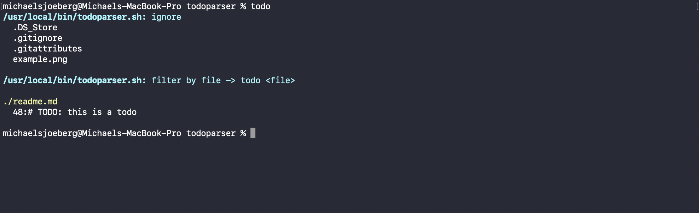

# todoparser.sh

## Usage

Download and `cd` into folder, then make `todoparser.sh` executable.

```bash
chmod u+x todoparser.sh
```

Copy `todoparser.sh` to `/usr/local/bin`.

```bash
cp todoparser.sh /usr/local/bin
```

Create `alias` in `.zshrc` (or whatever).

```bash
alias todo=/usr/local/bin/todoparser.sh
```

Reload.

```bash
source ~/.zshrc
```

Run.

```bash
todo
```

## .todoignore

Create `.todoignore` to ignore files.

```
.DS_Store
.gitignore
.gitattributes
```

## Example

```python
# TODO: this is a todo
```



