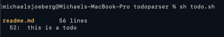

# todo.sh

A simple utility to find TODO comments in files.

```shell
sh todo.sh <path/to/file>
```

## Usage

Download and `cd` into folder, then make `todo.sh` executable.

```shell
chmod u+x todo.sh
```

Copy `todo.sh` to `/usr/local/bin`.

```shell
cp todo.sh /usr/local/bin
```

Create `alias` in `.zshrc` (or whatever).

```shell
alias todo=/usr/local/bin/todo.sh
```

Reload.

```shell
source ~/.zshrc
```

Run.

```shell
todo
```

## .todo

Use `todo init` to create `.todo`-file in project root folder, add filenames to this file to include in search.

```
readme.md
```

## Example

```python
# TODO this is a todo
```



